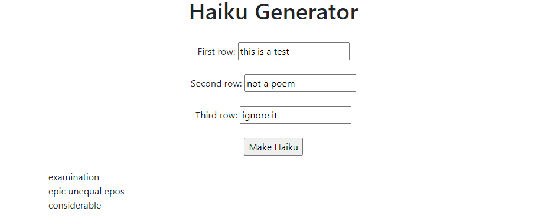

# Haiku Generator

- Type some words into each line (must be valid words)
- Click 'Make Haiku'
- Generator returns words in correct syllable form (5-7-5)

### To do

- Add logic holding onto original query results&cycling through to generate multiple outputs for each input
- add parts of speech logic to make output more structured
- add buttons/logic for clearing and starting over with new input once once is implemeneted
- add buttons to update only certain lines
